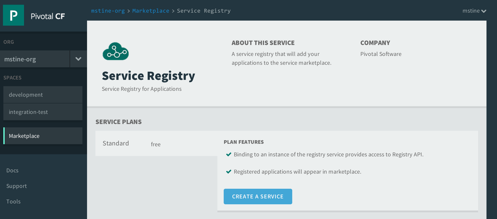
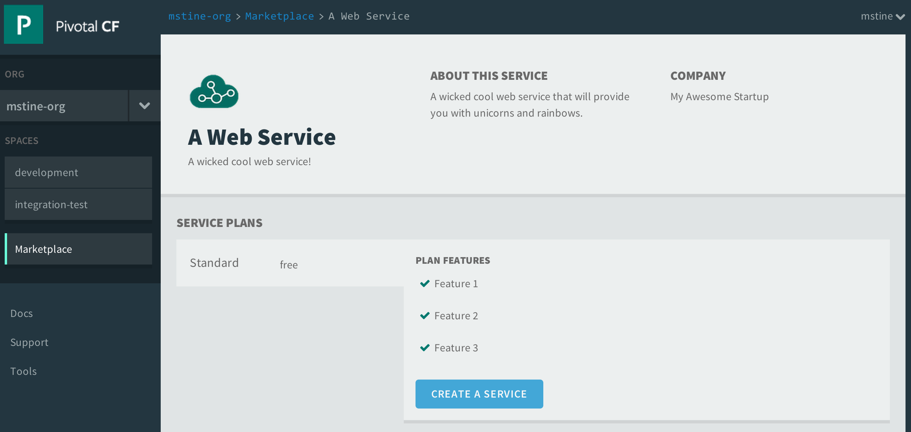

= Cloud Foundry Service Registry Broker
Matt Stine <mstine@pivotal.io>

_This is an experimental project not suitable for production use!_

This repository contains two projects:

+service-registry-broker+:: A service broker which acts as a _service registry_ for web services applications deployed to an instance of Cloud Foundry.
+service-registry-client+ (WIP - not pushed yet):: A Java client library extension to http://projects.spring.io/spring-cloud[Spring Cloud] which will automatically register Spring applications in the registry once bound to an instance of the Service Registry service.

== Usage

=== Build and Deploy Service Registry Broker

_This application currently depends on a version of https://github.com/cloudfoundry/cf-java-client that has not yet been released to Maven Central. Until this message has been removed, you will need to clone, build, and locally install that library._

. After cloning, build the application:
+
[source,text]
----
$ ./gradlew assemble
----

. Create an instance of a MySQL service. Assuming you're running on Pivotal CF:
+
[source,text]
----
$ cf cs p-mysql 100mb-dev cf-srb-db
Creating service cf-srb-db in org mstine-org / space development as admin...
OK
----

. Create a +manifest.yml+ file at the root of the repository with the following contents. Substitute all occurrences of +<token>+ with proper values for your Cloud Foundry environment:
+
[source,text]
----
---
applications:
- name: cf-service-registry-broker
  memory: 512M
  instances: 1
  path: service-registry-broker/build/libs/cf-service-registry-broker-0.0.1-SNAPSHOT.jar
  env:
    CF_API: https://api.<your_system_domain>
    CF_ADMIN_USER: <your_CF_admin_user>
    CF_ADMIN_PASSWORD: <your_CF_admin_space>
    CF_ORG: <a_valid_CF_org>
    CF_SPACE: <a_valid_CF_space>
    SPRING_PROFILES_ACTIVE: cloud
  services:
  - <name_of_mysql_service_you_created>
----

. Push the application:
+
[source, text]
----
$ cf push
----

. Once the application starts, you should see it in the services marketplace:
+
[source,text]
----
$ cf marketplace
Getting services from marketplace in org mstine-org / space development as admin...
OK

service            plans          description
p-mysql            100mb-dev      MySQL service for application development and testing
service-registry   Standard       Service Registry for Applications
----
+

=== Using the Service Registry

Creating an instance of this service and binding it to your application will inject the URL and credentials for the service registry API into +VCAP_SERVICES+:

[source,text]
----
VCAP_SERVICES={"service-registry":[{"name":"my-service-registry","label":"service-registry","tags":[],"plan":"Standard","credentials":{"uri":"http://cf-service-registry-broker.cf.deepsouthcloud.com/registry","username":"warreng","password":"natedogg"}}]}
----

The registry currently supports two operations, _register_ and _unregister_. Here are some examples illustrated via curl:

.Register
[source,text]
----
$ curl -i -u warreng:natedogg http://cf-service-registry-broker.cf.deepsouthcloud.com/registry -X POST \
-d '{"name":"a-web-service","description":"A wicked cool web service!","longDescription":"A wicked cool web service that will provide you with unicorns and rainbows.","displayName":"A Web Service","provider":"My Awesome Startup","features":["Feature 1","Feature 2","Feature 3"],"url":"http://my.url.com","basicAuthUser":"tupac","basicAuthPassword":"makaveli"}' \
-H "Content-Type: application/json"
HTTP/1.1 201 Created
Content-Type: application/json;charset=UTF-8
Date: Wed, 06 Aug 2014 20:28:39 GMT
Server: Apache-Coyote/1.1
Strict-Transport-Security: max-age=31536000 ; includeSubDomains
Transfer-Encoding: chunked
X-Application-Context: cf-service-registry-broker:cloud:0

{"id":"2cfadfbf-0711-41ec-9512-55ef48d71c81"}
----

And here's what a registered service based on this request looks like:

.Unregister
[source,text]
----
$ curl -i -u warreng:natedogg http://cf-service-registry-broker.cf.deepsouthcloud.com/registry/2cfadfbf-0711-41ec-9512-55ef48d71c81 -X DELETE
HTTP/1.1 200 OKContent-Length: 2
Content-Type: text/plain;charset=ISO-8859-1
Date: Wed, 06 Aug 2014 20:29:32 GMT
Server: Apache-Coyote/1.1
Strict-Transport-Security: max-age=31536000 ; includeSubDomains
X-Application-Context: cf-service-registry-broker:cloud:0

{}
----
